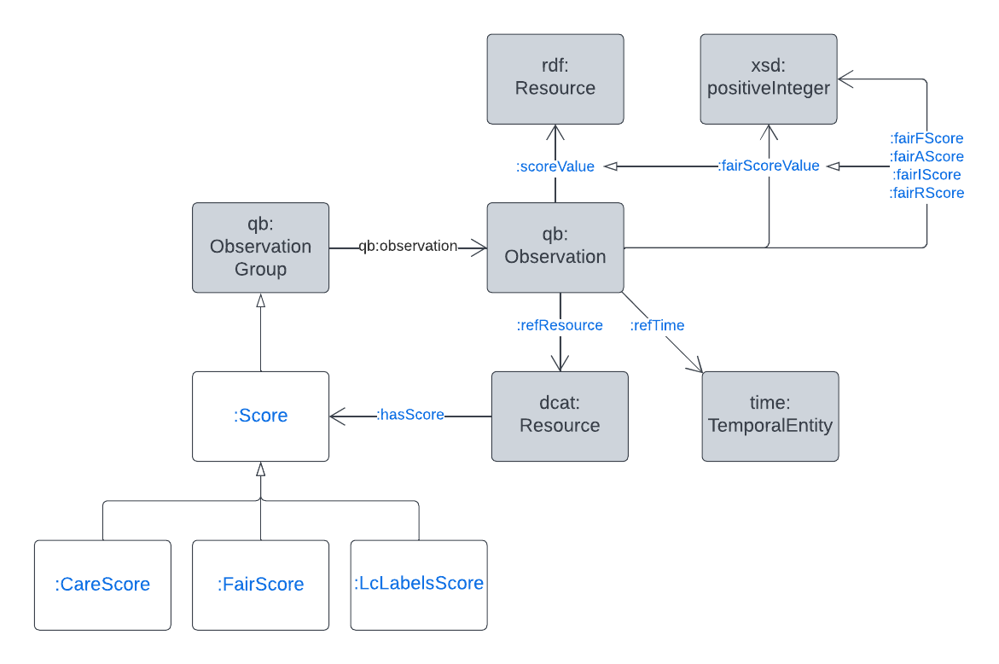

= Scores Model

This folder contains the Scoring Model within the Indigenous Data Network's Catalogue Data Profile.

This Scores Model is used to represent the scores of resources in catalogues according to various principles, such as the FAIR and CARE principles, and to link catalogues resources to their scores.

The model is as an OWL ontology, within the file _scores.ttl_ and the elements of the ontology are also provided as a _DefinedNamespace_ Python object for use with the https://github.com/rdflib/rdflib[RDFLib] RDF manipulation software library.

An overview of this model's classes and properties, and their relations to common model elements is given below:

[#img-rdf]
.Overview of the Scores Model
